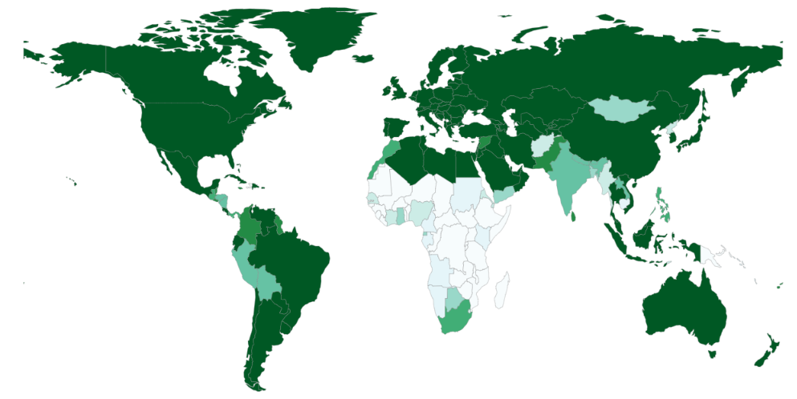
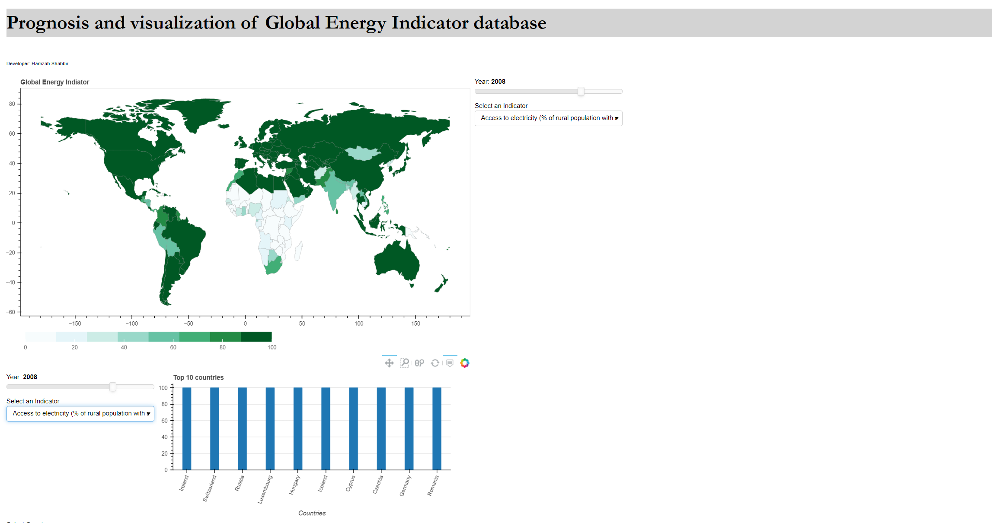
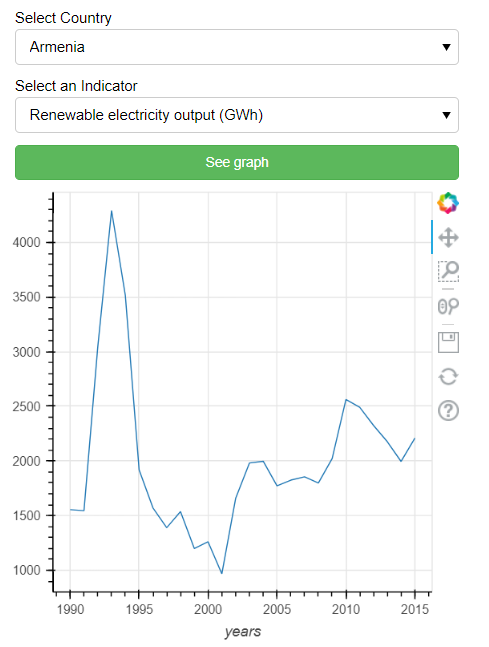
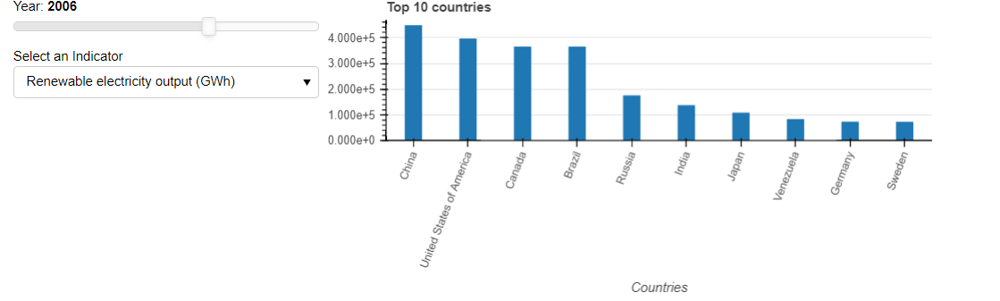

    
# Forecasting and visualization of global database for different energy parameters

This project is focussed on development of global database for different energy indicators using Autoregressive integrated moving average(ARIMA) model.

## backend.py
This script will implement forecasting model for all countries and will forecast result till year as given by input.

## main.py
This script is for creating server for data visualization. This script will take original data from database and create different interactive visulaization. This app has been deployed in Heroku and can be accessed from here: 
[Go to dashboard](https://dashhamzah.herokuapp.com/)

## Energy indicators
Following Energy Indicators has been used for this project:
* Access to Clean Fuels and Technologies for cooking (% of total population)
* Access to electricity (% of rural population with access)
* Access to electricity (% of total population)
* Access to electricity (% of urban population with access)
* Energy intensity level of primary energy (MJ/2011 USD PPP)
* Renewable electricity output (GWh)
* Renewable electricity share of total electricity output (%)
* Renewable energy consumption (TJ)
* Renewable energy share of TFEC (%)
* Total electricity output (GWh)
* Total final energy consumption (TFEC) (TJ)

## Data
Data has been collected from World bank open source databse.
## Optimizations

Time Series model that has been used in this project has been optimzed based on Akaike information criterion(AIC) and Bayesian information criterion(BIC) score.

  
## Authors

- [@Hamzahshabbir](https://github.com/hamzahshabbir96)

  
## Acknowledgements

 - [World Bank Database](https://www.worldbank.org/en/home)
 - [Bokeh dashboard](https://docs.bokeh.org/en/latest/index.html)
 - [Heroku Deployment](https://www.heroku.com/)

  
## Screenshots

  
## Feedback

If you have any feedback, please reach out to us at hamzahshabbir7@gmail.com

  
## 🔗 Links

  
## FAQ

#### 1. What this project is about?

Idea of this project is to implement time series model to forecast different energy parameter of the world for example what percent of ppulation will be able to access electricity in future. Time series model includes famous Autoregressive integrated moving average model.
#### 2. Is there any dashboard or visualization to get glimpse of data? 

Yes this app has been deployed for visualization. It can be followed from here : [Go to dashboard website](https://dashhamzah.herokuapp.com/)

#### 3. Does visualization part include forecasted database?

No Visualization only includes data from World databank(original data). Since accuracy of ARIMA model depends on lot of factors such as choosing AR and MA parameter. It has to be manually computed and to avoid wrong interpretations of forecasted data, it was not visually presented.

#### 3. Can I deploy your code?

If you are really interested in this project then you can collab with me and we can furthur improve model. You can reach me by my email hamzahshabbir7@gmail.com or [linkedIn](https://www.linkedin.com/in/hamzah-shabbir-108765a5/). 
